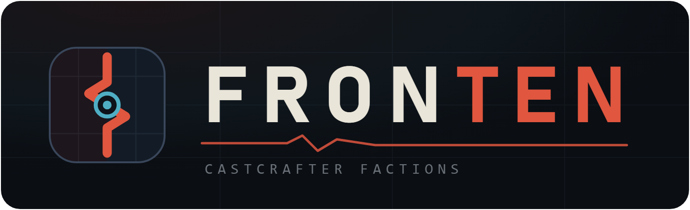

<p align="center">
  
</p>

<p align="center">
  <b>Interaktiver Konzept-Explorer</b> für einen CastCrafter Factions-Server 2026.<br>
  25 Kernsysteme · 50 Feature-Ideen · interaktive Lagekarte · Umsetzungsplan.
</p>

---

## Über das Projekt

Diese App macht das Konzeptpapier **FRONTEN** durchklickbar: Jedes System und jede Feature-Idee hat
eine eigene Seite mit *Was ist das?*, *Wie funktioniert es?*, *Warum* und den **Verbindungen** zu
verwandten Features. Die **Lagekarte** zeigt das Geflecht aller Kernsysteme als interaktiven Graphen.

Ergänzungen über das Original-Papier hinaus (konkrete Zahlenvorschläge, Balancing-Hinweise,
Empfehlungen zu offenen Fragen) sind durchgängig als violette **◆ Ausbau**-Blöcke markiert.

## Tech-Stack

- **Next.js 14** (App Router), läuft als echter **Node-Server** (`next start`)
- **React 18** + **TypeScript**
- Keine Datenbank — alle Inhalte liegen typisiert in [`src/data.ts`](./src/data.ts); die Komponenten
  rendern rein datengetrieben. Die Feature-Seiten werden beim Build statisch vorgerendert (SSG) und
  vom Server ausgeliefert.

## Lokal starten

```bash
npm install
npm run dev        # http://localhost:3000
```

## Bauen & als Server hosten

```bash
npm run build      # erzeugt den Produktions-Build in ./.next
npm run start      # startet den Node-Server (Standard-Port 3000)
# Port setzen: npm run start -- -p 8080
```

Hosting-Optionen:

- **Vercel** – Repo importieren, fertig (Framework-Preset „Next.js“, managed Server).
- **Eigener Node-Host / VPS** – `npm ci && npm run build`, dann `npm run start` (idealerweise unter
  einem Prozess-Manager wie **pm2** oder als **systemd**-Service), davor ein Reverse-Proxy (nginx).
- **Docker** – `node:20-alpine`, Build im Image, Start via `npm run start`.
- **Railway / Render / Fly.io** u. ä. – Build `npm run build`, Start `npm run start`.

> Benötigt eine Node-Laufzeit (Node ≥ 18) zur Laufzeit — anders als ein statischer Export.

## Projektstruktur

```
src/
  app/                 App-Router-Seiten (Home, /system/[id], /idee/[id], /ideen, /graph, …)
    icon.svg           Favicon (wird von Next automatisch eingebunden)
  components/          Wiederverwendbare Komponenten (Blocks, Chips, Connections, Graph, …)
  lib/helpers.ts       Nachschlage-Maps, Routen, Graph-Farben
  data.ts              Alle Inhalte + Typen (Single Source of Truth)
public/
  logo.svg / logo.png  Wortmarke + Logo
```

Inhalte pflegst du ausschließlich in `src/data.ts` — neue Ideen oder Systeme erscheinen automatisch in
Navigation, Katalog und Graph.
